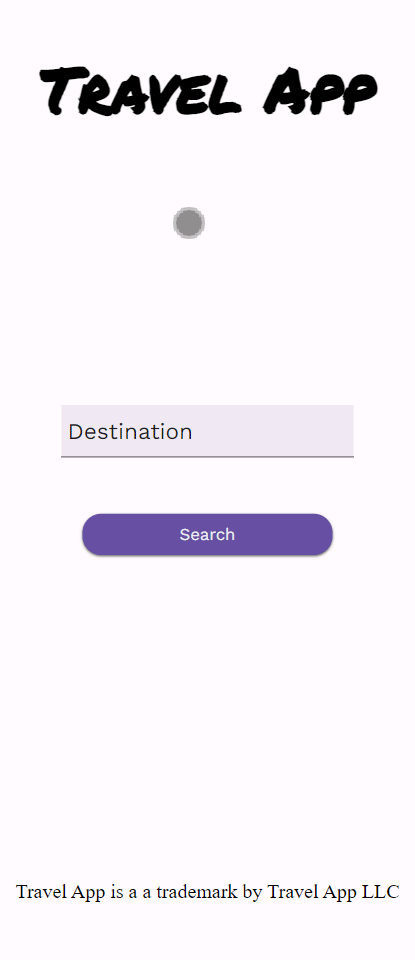

<p align="center">
  <h3 align="center">Travel App</h3>

  <p align="center">
    Basic Travel App <br>
   Part of the Udacity Frontend Nanodegree
    <br>
    </p>
</p>

<br>

## Table of contents

- [About the Website](#about-the-website)
- [Technical](#technical)
- [Licence](#license)
- [Versions](#versions)
- [Contact Information](#contact-information)

### About the website

Basic travel app.

<p align="center">
  
</p>

### Technical

#### Technology Used

This project uses: - HTML - CSS - SCSS - JS - NodeJS - Webpack - Babel

#### Running the project

A `.env` file needs to be created at the root of the project with the following text

- **GEONAMES_USERNAME** obtained from [geonames](https://geonames.org/).
- **PIXABAY_API_KEY** obtained from [pixabay](https://pixabay.com/).
- **WEATHERBIT_API_KEY** obtained from [weatherbit](https://www.weatherbit.io/).

The npm packages need to be installed by running

```console
npm install
```

Once the installation process has been done, to run the project, you can run the backend server in developer mode by running:

```console
npm run serve-dev
```

To run the server in production mode, run:

```console
npm run serve-prod
```

To run the fronted in developer mode, you can simply run:

```console
npm run build-dev
```

To run the frontend in production mode, you can simply run

```console
npm run build-prod
```

To run both the frontend and backend in production mode, you can simply run

```console
npm run start
```

To run tests, you can simply run

```console
npm run test
```

Once the project is running, the website (frontend) can be accessed from `localhost:8080` by default. The api can be accessed from `localhost:3000`

#### CONTRIBUTING

I would/ We'd love to have your help in making **{this app (replace with name of your project)}** better. The project is still very incomplete, but if there's an issue you'd like to see addressed sooner rather than later, let me(/us) know.

Before you contribute though read the contributing guide here: [COntributing.md](https://github.com/peterokwara/travel-app/blob/master/CONTRIBUTING.md)

For any concerns, please open an [issue](https://github.com/peterokwara/travel-app/issues), or JUST, [fork the project and send a pull request](https://github.com/peterokwara/travel-app/pulls).

<hr>

### License

- see [LICENSE](https://github.com/peterokwara/travel-app/blob/master/LICENSE) file

### Versions

- Version 1.0 DATE 24/11/2021

### Contact Information

If you have found any bugs, or have any feedback or questions and or want to post a feature request please use the [Issuetracker](https://github.com/peterokwara/travel-app/issues) to report them.

<hr>

[](#)

<br>

[](https://github.com/peterokwara/travel-app/blob/master/LICENSE)
